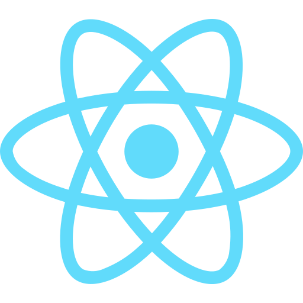
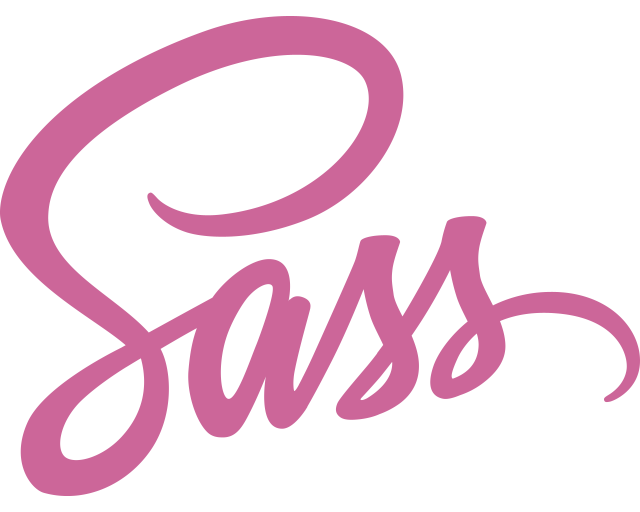
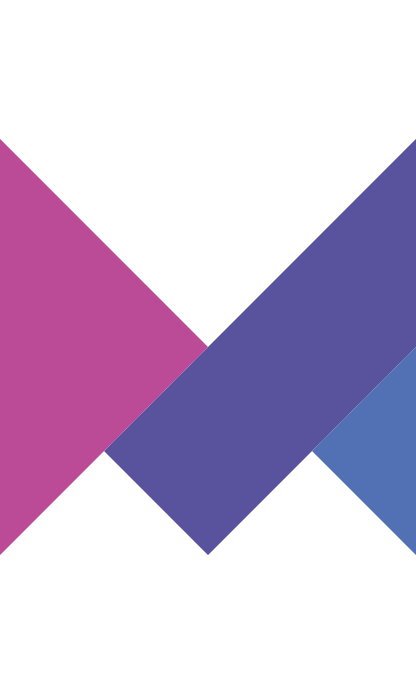
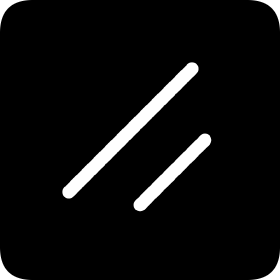

# Mateusz Miszczak

**`Digital Craftsman`**

As a yet junior front-end developer passionate about expanding my expertise, I've embraced new technologies over the past year, notably Next.js, TypeScript, and advanced libraries like Recoil and Tanstack React-query. These tools complement my foundational skills in React, enhancing my ability to create dynamic and responsive applications.
Additionally, I've delved into CSS libraries for animations and UI components, to further refine and streamline the development process. I've also learned to use Figma and a bit of AdobeXd which enables me to design and prototype websites more efficiently.

I believe in discipline and consistency as the pillars of professional growth. Outside of programming, my interests include music, fitness, and cultural events. My technical and personal pursuits are driven by a commitment to excellence and a positive, problem-solving attitude. I would love to work in a communicative, like-minded team so we can excel in this field together.

Feel free to check out my latest projects to see these technologies in action!

---

### Current Tech Stack:

  
  
  
  
  
  
  
  
  
  
  
  
  
  
  
  
  
  

