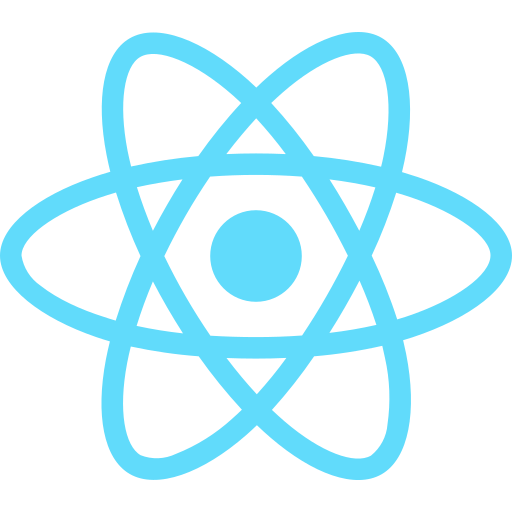
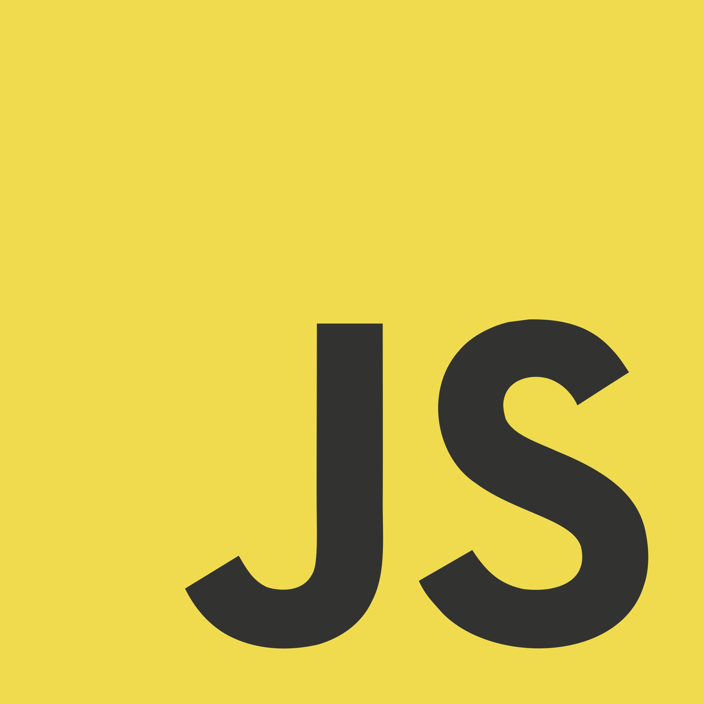
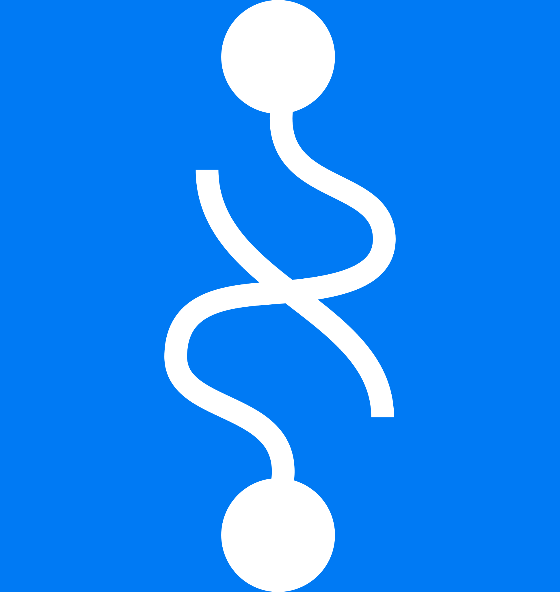
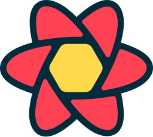
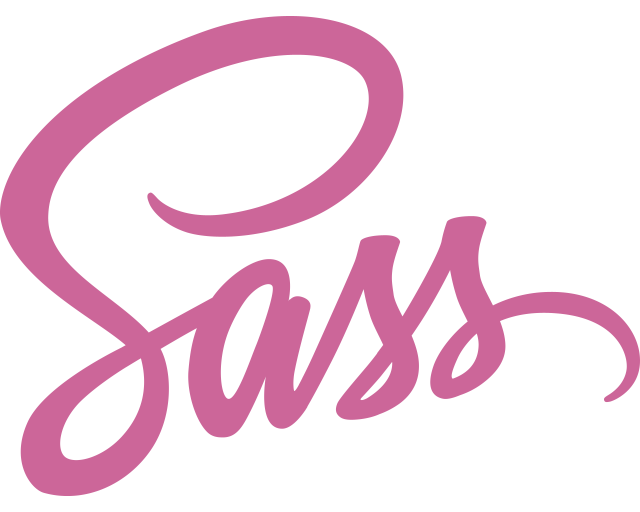
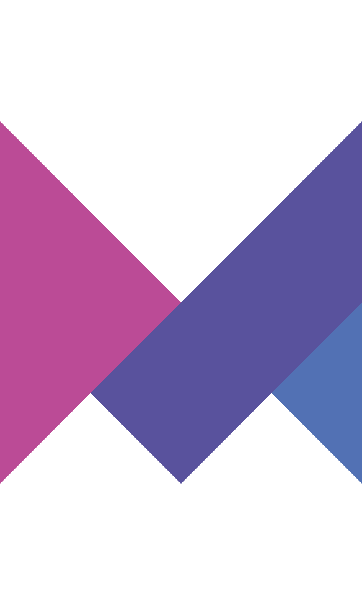
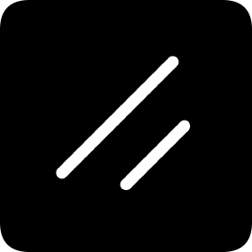
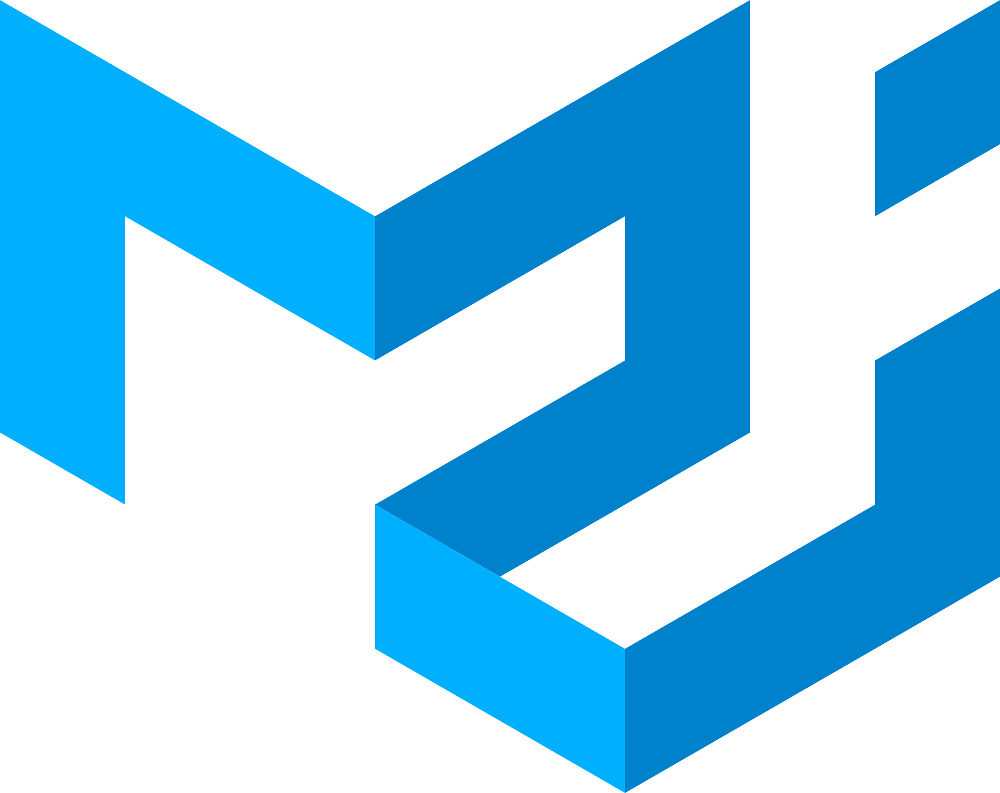
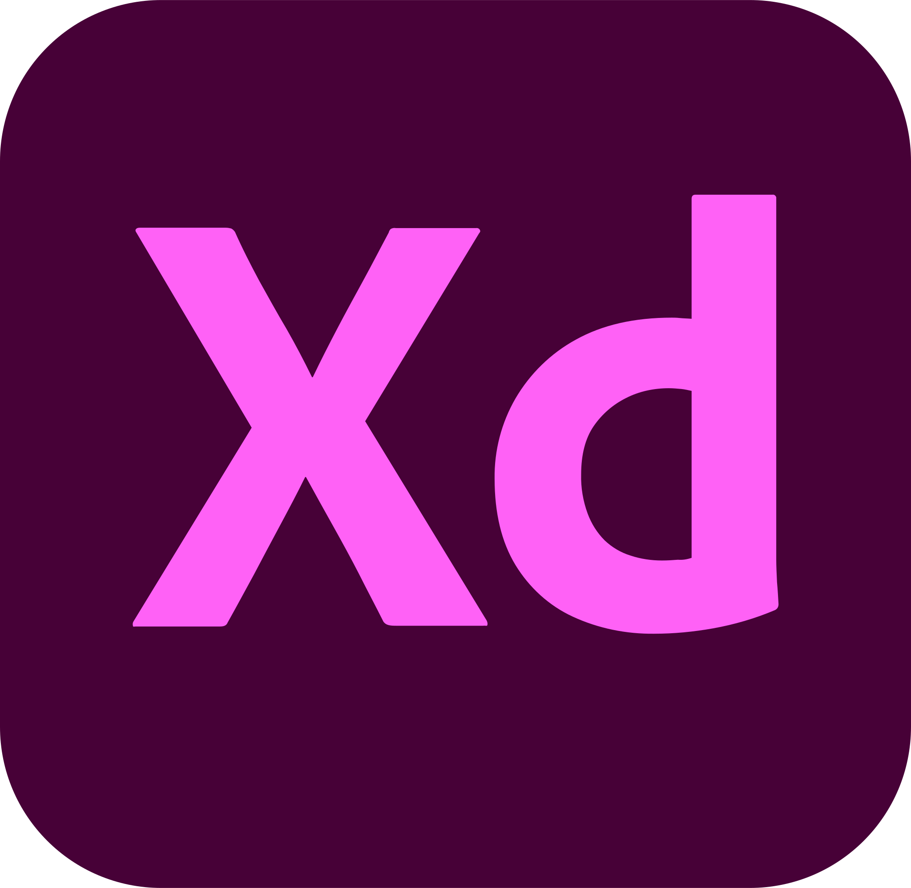
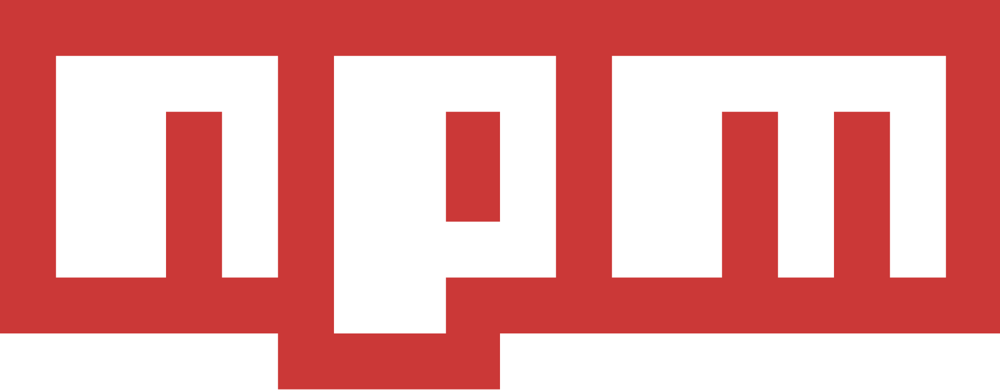

# Mateusz Miszczak

**`Digital Craftsman`**

Frontend Developer focused on React, Next.js and TypeScript.

I build production-ready web applications with a strong focus on maintainable code, clean UI architecture and real business workflows. My recent work includes fintech interfaces, customer portfolio views, multi-step financial flows, admin systems, WebSocket-driven realtime updates and CMS-driven multilingual websites.

I enjoy working across the full frontend delivery process — from translating product requirements and designs into responsive interfaces, to integrating APIs, handling complex UI state, improving performance and extracting reusable frontend packages in monorepo environments.

My main stack includes React, Next.js, TypeScript, React Query, Redux Toolkit, Tailwind CSS, MUI, REST APIs, WebSockets, Strapi CMS and Turborepo. I’m also expanding my backend and infrastructure understanding through Node.js, PostgreSQL, Docker, AWS and Terraform basics.

I value consistency, ownership and clear communication. Outside of programming, I’m interested in fitness, music and culture.

---

### Current Tech Stack:

  
  
  
  
  
  
  
  
  
  
  
  
  
  
  
  
  
  

