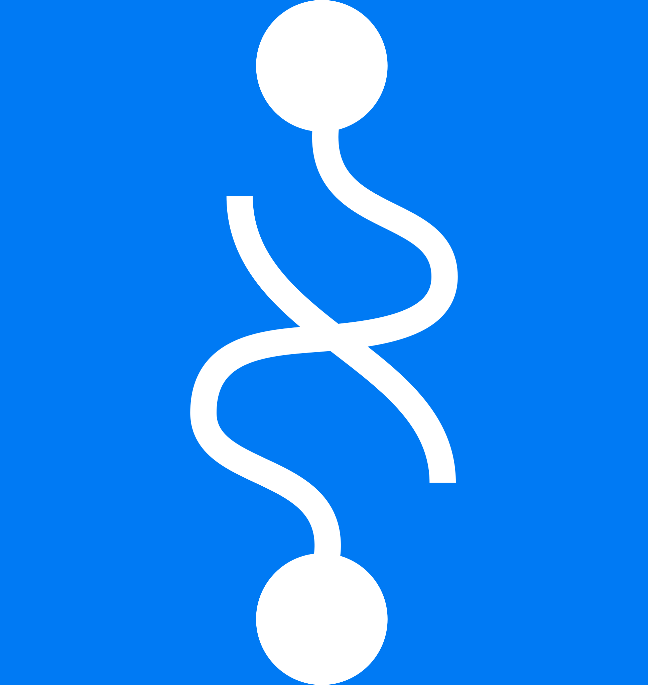
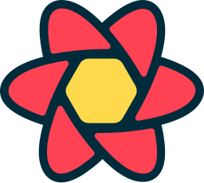
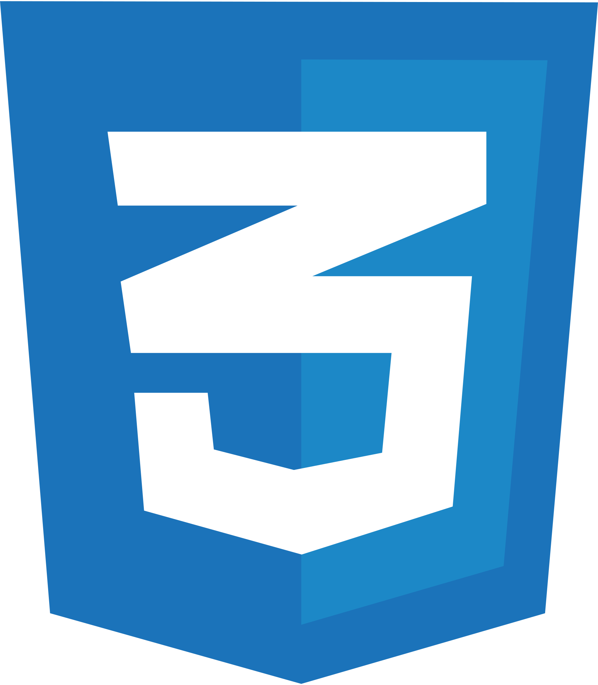
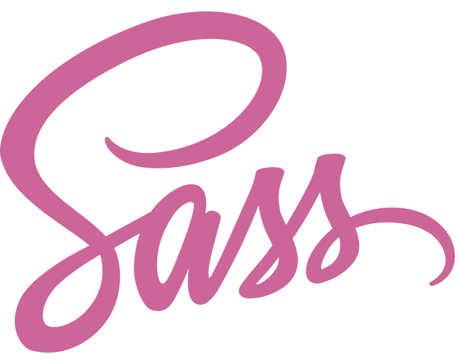
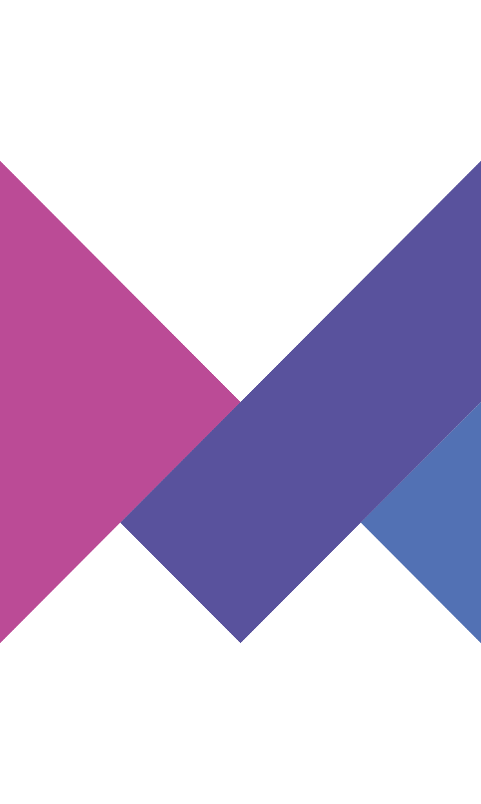
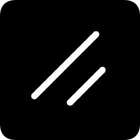

# Mateusz Miszczak

**`Digital Craftsman`**

Frontend Developer focused on React, Next.js and TypeScript.

I build production web applications, mainly for fintech and business platforms. My work includes dashboards, customer and admin panels, multi-step flows, API integrations, realtime features with WebSockets and reusable frontend components.

I work across the full frontend process - from implementing designs and product requirements to handling application state, integrating backend services and improving code structure in larger projects and monorepos.

My main stack includes React, Next.js, TypeScript, TanStack Query, Redux Toolkit, Tailwind CSS, MUI, REST APIs, WebSockets, Strapi and Turborepo.

---

### Current Tech Stack:

  
  
  
  
  
  
  
  
  
  
  
  
  
  
  
  
  
  

